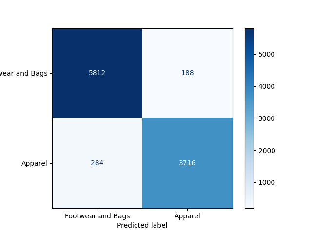

# Fashio MNIST Classification

The scripts of this project are design to perform classigfication tasks. Below are the available parameters information to run the scripts.

## Exercise 1

### Usage

```bash
python exercise_1.py -a <action>
```

#### Parameters descriptions

- `-a`, `--action`: `[Required]` the actions to perform on the script with the following choices: `"train"` or `"test"`

#### Examples

```bash
python exercise_1.py -a train
```

This command will train the model.

```bash
python exercise_1.py -a test
```

This command will test the model.

## Exercise 2

### Usage

```bash
python exercise_2.py -a <action>
```

#### Parameters descriptions

- `-a`, `--action`: `[Required]` the actions to perform on the script with the following choices: `"train"` or `"test"`
- `-mn`, `--model-name`: `[Not Required]` the checkpoint name to use to load and save the models weights

#### Examples

```bash
python exercise_2.py -a train
```

This command will train the model.

```bash
python exercise_2.py -a test
```

This command will test the model.

```bash
python exercise_2.py -a test -mn best_model_exerc_1_copy
```

This command will test the model using the best_model_exerc_1_copy saved weights.

## Exercise 3

Since theb main goal here is to compare the models behavior and answer the following question:

`For the binary classification “Clothing”/ “Footwear and luggage” it will be better to use the network to
multiclass classification and then “binarize” the predictions? Or would it be better to use the neural network
designed to directly perform binary classification?`

In order to test this on the scripts to see the results and compare the following scripts must be executed:

### With pre trained model (Transfer Learn)

Using model from Exercise 2 but using transfer learn from the model train on Exercise 1

```bash
python exercise_2.py -a test -mn best_model_exerc_1_copy
```

The confusion metrics will look like this:



### Without pre trained model

Using only the model from Exercise 2

```bash
python exercise_2.py -a test
```

The confusion metrics will look like this:


### Conclusion

Based on the images we can see that by using the pre trained model from Exercise 1 in the Exercise 2 the results are way better.
In other words, answering the question, in this set of data using the results obtained according to the images, for the binary classification “Clothing”/“Footwear and luggage” it will be better to use the network for multiclass classification and then “binarize” the predictions, as the results are better.
And considering the confusion matrices, we can see that the network for multiclass classification, which was then made to “binarize” the predictions, has a higher hit rate.

## Group elements:

- Eduardo Miguel dos Anjos Miradouro e Silva
- Kevin Anderson Gomes Cabral
- Roberto Carlos Medina
